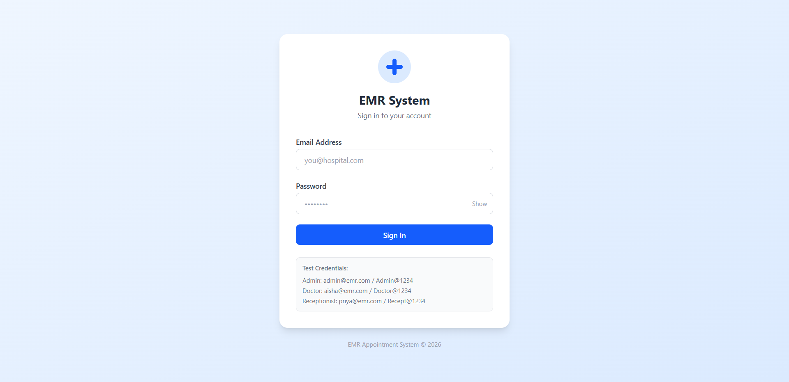
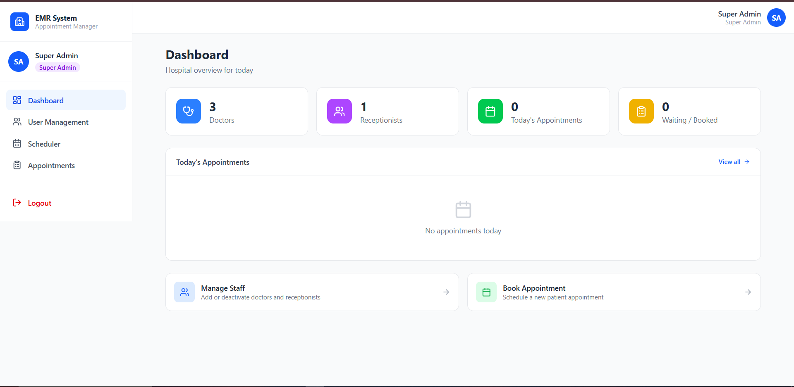
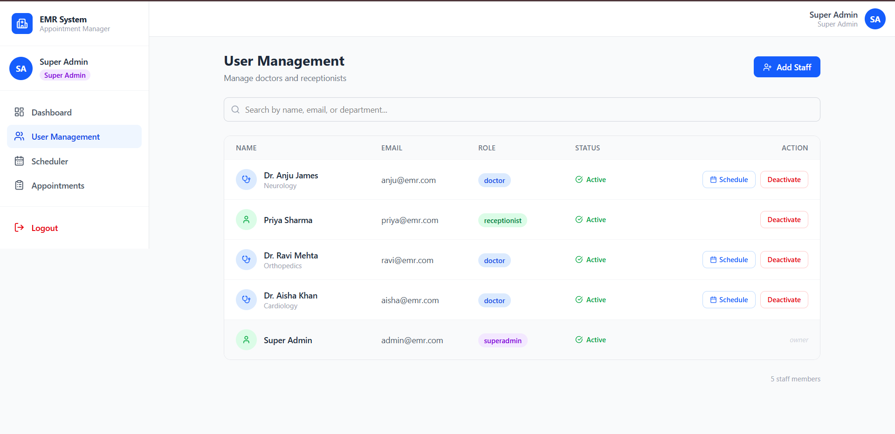
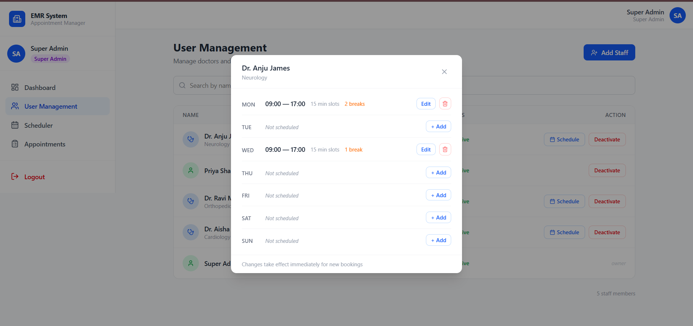
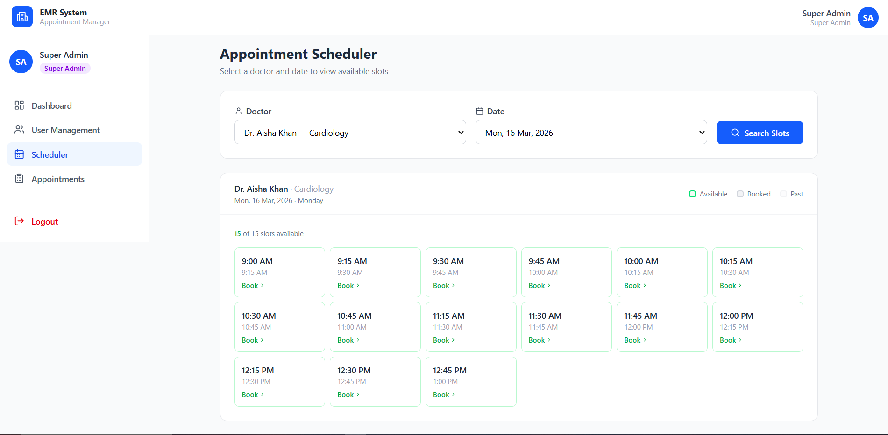
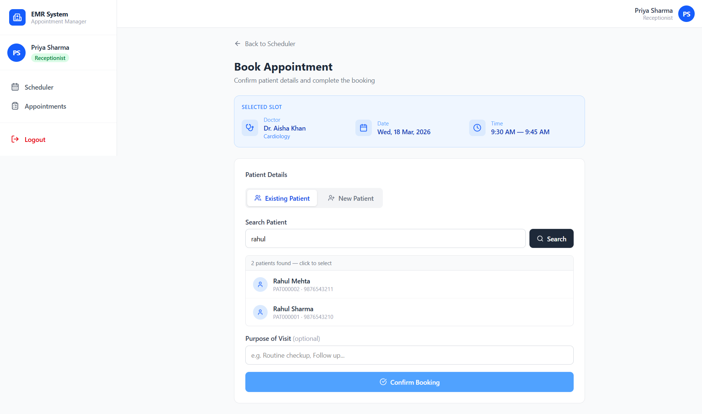
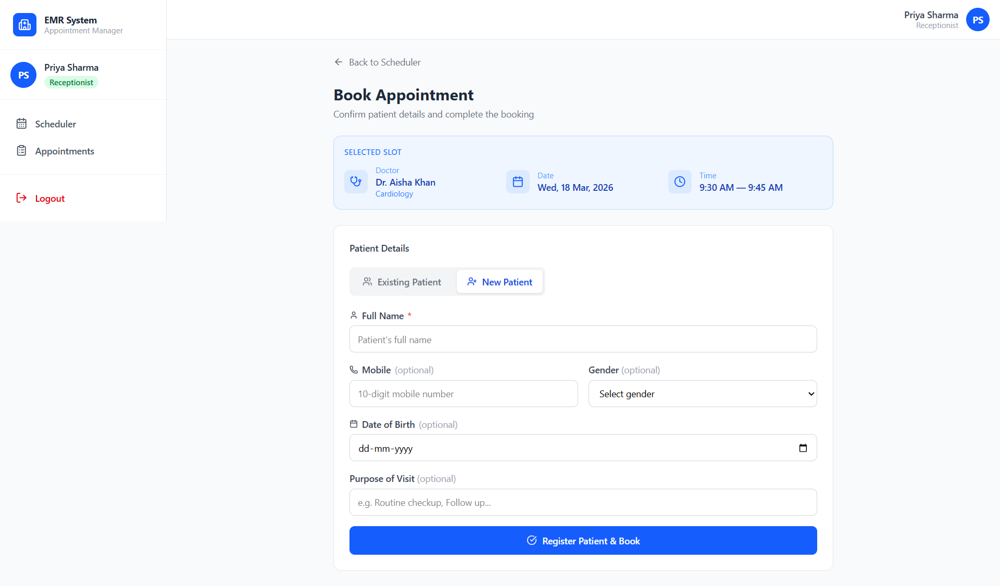
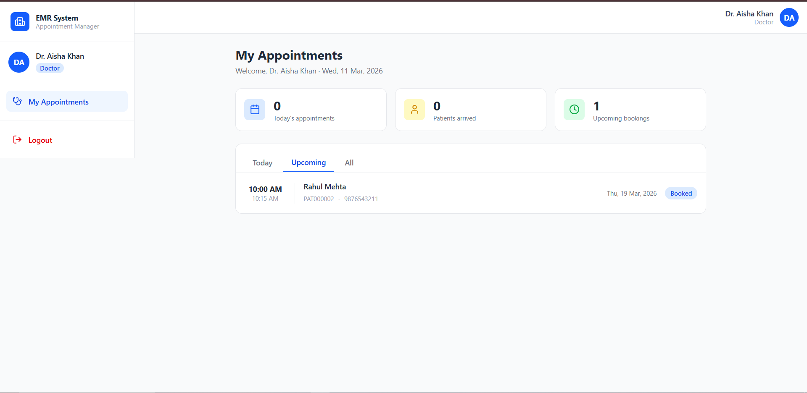

# MERN EMR Appointment System — Frontend

Frontend for a role-based EMR appointment scheduling system.

**Backend / API Repository:**
[https://github.com/Annan-Andrews/EMR-Appointment-System---Backend](https://github.com/Annan-Andrews/EMR-Appointment-System---Backend)

---

# Roles & Features

### Super Admin

* Manage doctors
* Manage receptionists
* Configure doctor schedules

### Receptionist

* View available slots
* Book appointments
* Manage patients
* Manage appointments

### Doctor

* View only their own appointments

---

# Tech Stack

* React + Vite
* Redux Toolkit
* React Router
* Axios
* TailwindCSS

---

# Local Setup

## 1) Install Dependencies

```bash
npm install
```

---

## 2) Configure Environment Variables

Create a `.env` file in the project root.

```env
VITE_API_URL=http://localhost:5000/api
```

---

## 3) Run Development Server

```bash
npm run dev
```

The app runs on the Vite URL printed in the terminal (commonly `http://localhost:5173`).

---

# Authentication Notes (Important)

* Access token is stored client-side and sent as:

```
Authorization: Bearer <token>
```

* Refresh token is stored as an **httpOnly cookie** set by the backend.

* Axios interceptor automatically calls:

```
POST /auth/refresh
```

when a `401` response occurs and retries the failed request.


---

# Demo Credentials

⚠️ These credentials are provided for **demonstration and testing purposes only**.

**Super Admin**  
admin@emr.com / Admin@1234

**Doctor**  
aisha@emr.com / Doctor@1234

**Receptionist**  
priya@emr.com / Recept@1234

---


## Login



---

## Admin Dashboard



---

## User Management



---

## Doctor Schedule Modal



---

## Scheduler Slots



---

## Booking Existing Patient



---

## Booking New Patient



---

## Doctor Dashboard


